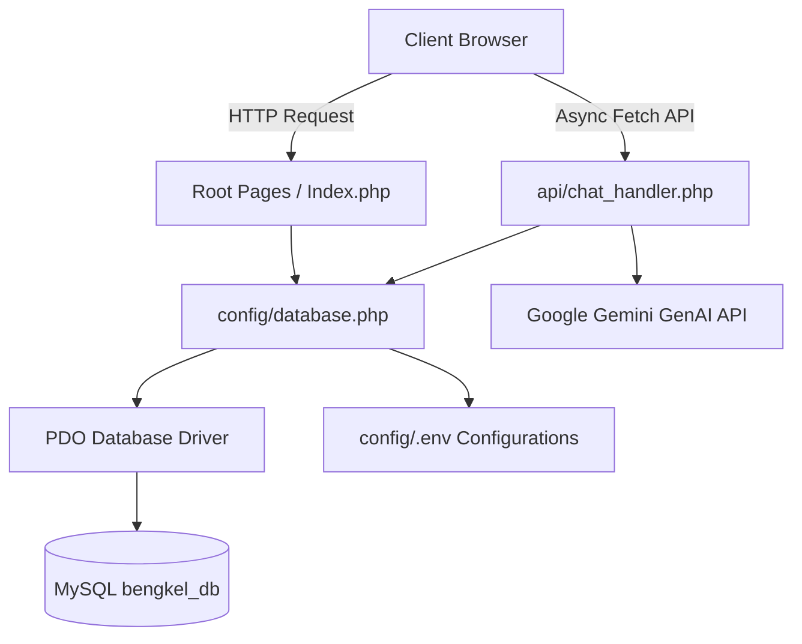

# Architectural Overview & Project Structure

This document outlines the high-level architecture and organizational philosophy behind **InfoMotive**. Built using native PHP 8, the application adopts a lightweight, clean procedural structure inspired by modern MVC separation of concerns.

## 🏗️ Design Philosophy

The main objective of this architectural structure is to maintain zero external bloated dependencies while demonstrating clear separation between data access, business logic, external AI API handling, and presentation layers.

## 📂 Detailed Directory Structure

### `admin/`
Contains the secured administration dashboard. Protected via session handling, allowing administrators to execute CRUD operations on products, articles, and workshops.
- `admin/barang/index.php`: Product catalog management.
- `admin/artikel/`: Article knowledge base management.

### `api/`
The RESTful communication layer used for asynchronous JavaScript requests (AJAX/Fetch API).
- `api/chat_handler.php`: The core engine for **BotMotif**. Houses the Intent Detection algorithm, Retrieval-Augmented Generation (RAG) query expansions, multi-model fallback chain (`gemini-1.5-flash` -> `gemini-1.5-flash-8b` -> `gemini-1.5-pro`), and local fallback rules.

### `assets/`
Holds static resources served directly to the client.
- `assets/css/style.css`: Custom Vanilla CSS rules establishing the Glassmorphism design tokens, variables, and responsive layout grids.
- `assets/images/`: Cached static images and placeholder assets.

### `auth/`
Authentication boundary for session initialization and administrative access control.
- `auth/login.php`: Secure login portal verifying password hashes (`password_verify`).
- `auth/logout.php`: Destroys active user sessions and redirects to the landing page.

### `config/`
Application lifecycle configuration and environment management.
- `config/.env`: Environment variable file isolating sensitive secrets (ignored by Git).
- `config/.env.example`: Sanitized configuration template for deployment reference.
- `config/database.php`: Bootstraps PDO connection, verifies database tables, and executes automated schema updates.
- `config/ai_config.php`: Establishes AI provider constants and extracts API keys from environment settings.

### `database/seeds/`
Protected database initialization and seeding utilities. Secured to prevent unauthorized access via HTTP web requests.
- `import_articles.php`: Parses automotive news feeds and seeds the `articles` table.
- `import_products.php`: Populates the `products` table with real-world curated pricing data.
- `seed_bengkel.php`: Seeds verified workshop locations with latitude and longitude data.
- `reset_admin.php`: Administrative recovery tool to re-establish the default admin account.

### `includes/`
Modular presentation components included across multiple pages to enforce visual consistency.
- `includes/chatbot_modal.php`: The interactive floating UI widget for BotMotif.

### `Root Pages`
The primary user-facing views combining the Glassmorphism UI components with dynamic database query displays.
- `index.php`: Premium scrollable landing page.
- `about.php`: Organization background, vision, and team grid.
- `edukasi.php`: Automotive knowledge base with category filters.
- `harga.php`: Spare part price transparency catalog with interactive view tracking.
- `bengkel.php`: Interactive map view of verified workshop directories.
