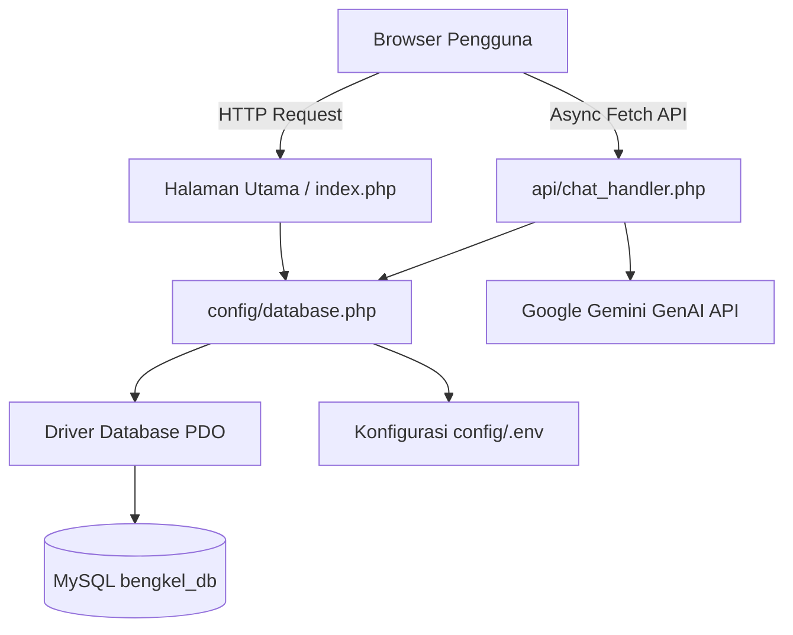

# Tinjauan Arsitektur & Struktur Project

Dokumen ini menjelaskan arsitektur tingkat tinggi (*high-level architecture*) dan filosofi pengorganisasian kode di balik aplikasi **InfoMotive**. Dibangun menggunakan PHP 8 native, aplikasi ini mengadopsi struktur prosedural yang ringan dan bersih, terinspirasi dari pemisahan tugas (*separation of concerns*) pada pola arsitektur MVC modern.

## 🏗️ Filosofi Desain

Tujuan utama dari arsitektur ini adalah mempertahankan kinerja yang sangat cepat tanpa ketergantungan pada pustaka (*dependencies*) eksternal yang berat, sekaligus menunjukkan pemisahan yang jelas antara akses data, logika bisnis, penanganan percakapan AI eksternal, dan lapisan presentasi (antarmuka).

## 📂 Rincian Struktur Direktori

### `admin/`
Berisi halaman dashboard pengelolaan (*Content Management System* / CMS). Sektor ini dilindungi oleh verifikasi sesi otentikasi, memungkinkan pengelola sistem untuk melakukan operasi CRUD (Create, Read, Update, Delete) pada data produk, artikel, dan lokasi bengkel.
- `admin/barang/index.php`: Halaman manajemen katalog produk.
- `admin/edukasi/index.php`: Halaman manajemen artikel edukasi.

### `api/`
Lapisan komunikasi RESTful API yang digunakan untuk menerima dan merespons permintaan asinkron dari JavaScript di sisi browser (*Fetch API* / AJAX).
- `api/chat_handler.php`: Mesin utama penggerak asisten virtual **BotMotif**. Memuat algoritma Deteksi Niat (*Intent Detection*), ekspansi kueri *Retrieval-Augmented Generation* (RAG), rantai fallback multi-model AI (`gemini-1.5-flash` -> `gemini-1.5-flash-8b` -> `gemini-1.5-pro`), serta mesin logika cadangan lokal (*local fallback engine*) apabila API melebihi kuota.
- `api/track_view.php`: Pencatat jumlah klik/tayang yang aman dari ancaman injeksi SQL.

### `assets/`
Menyimpan file statis yang disajikan langsung ke browser pengguna.
- `assets/css/style.css`: Aturan Vanilla CSS kustom yang merumuskan variabel desain *Glassmorphism*, palet warna premium, dan tata letak responsif (*flexbox* & *grid*).
- `assets/images/`: Menyimpan foto profil tim dan gambar aset pendukung.

### `auth/`
Gerbang masuk dan keluar otentikasi untuk verifikasi hak akses.
- `auth/login.php`: Portal masuk aman yang memvalidasi kecocokan enkripsi kata sandi menggunakan fungsi bawaan `password_verify()`.
- `auth/logout.php`: Mengakhiri sesi pengguna secara aman dan mengarahkan kembali ke halaman utama.

### `config/`
Pusat pengaturan siklus hidup aplikasi dan kredensial lingkungan.
- `config/.env`: File variabel lingkungan lokal yang memisahkan dan melindungi data rahasia (disembunyikan oleh `.gitignore`).
- `config/.env.example`: Templat konfigurasi bersih untuk panduan instalasi di komputer atau server lain.
- `config/database.php`: Menginisialisasi koneksi aman PDO (*PHP Data Objects*), memvalidasi keberadaan tabel, dan menjalankan skema pembaruan otomatis.
- `config/ai_config.php`: Membaca dan menetapkan variabel konstan untuk koneksi ke layanan Google GenAI.

### `database/seeds/`
Direktori terlindungi untuk skrip inisialisasi dan pengisian data otomatis (*seeder*). Sektor ini dikunci dengan validasi baris perintah (CLI) untuk mencegah eksekusi sepihak melalui browser web.
- `import_articles.php`: Mengambil umpan berita otomotif eksternal dan memuatnya ke dalam tabel `articles`.
- `import_products.php`: Mengisi tabel `products` dengan daftar harga dan suku cadang asli di pasaran.
- `seed_bengkel.php`: Mengisi data lokasi bengkel terpercaya beserta koordinat lintang dan bujurnya.
- `reset_admin.php`: Alat bantu pemulihan untuk mengatur ulang akun admin default.

### `includes/`
Komponen antarmuka modular yang diimpor secara dinamis ke berbagai halaman untuk memastikan konsistensi visual.
- `includes/chatbot_modal.php`: Struktur widget antarmuka mengambang untuk asisten pintar BotMotif.

### `Halaman Utama (Root Pages)`
Halaman presentasi utama yang mempertemukan estetika UI *Glassmorphism* dengan pemanggilan kueri database secara dinamis.
- `index.php`: Halaman beranda utama bergaya premium yang dapat digulir.
- `about.php`: Halaman profil platform, latar belakang visi, dan susunan tim pengembang.
- `edukasi.php`: Basis pengetahuan perawatan kendaraan dengan opsi penyaringan kategori.
- `harga.php`: Katalog transparansi harga suku cadang dengan fitur pelacak tayangan interaktif.
- `bengkel.php`: Direktori bengkel terpercaya dengan integrasi peta interaktif.
